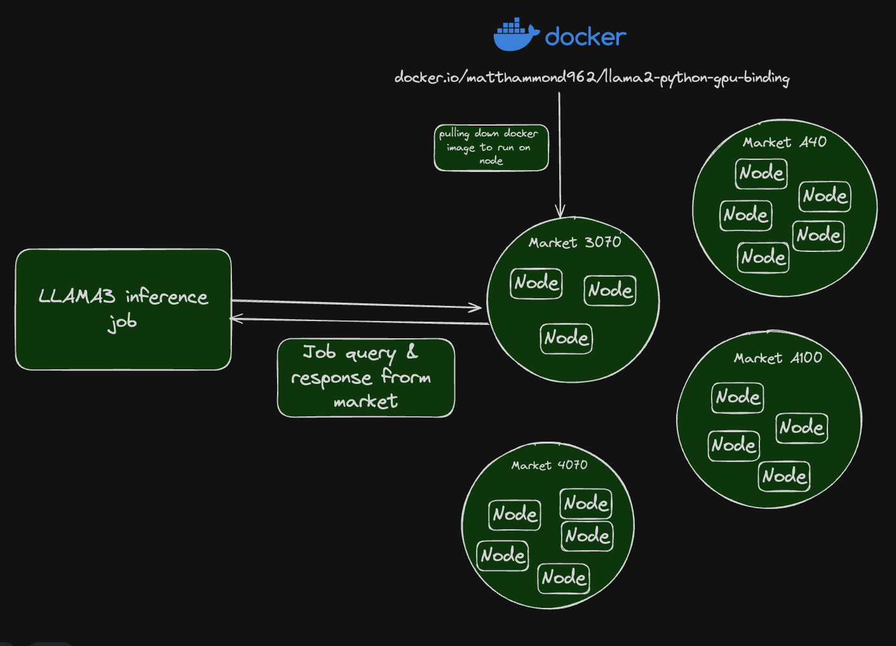

# Maven

<div align="center">
  
</div>

<div align="center">

 [Website](https://elizaos.github.io/eliza/)

</div>

## Introduction

Maven is revolutionizing the way on-chain agents access and utilizes computing power. Maven is providing a distributed GPU grid that enables anyone to rent compute power without the usual overhead, excessive fees, or vendor lock-in.

Maven is tackling the GPU shortage in the market, providing everyone with easy access to the necessary hardware. By leveraging underutilized hardware like gaming PCs, mining rigs, and MacBooks, Maven offers users to use $MAVEN tokens to build & deploy their own agents.

## Key Features
- Distributed GPU Grid
- No Vendor Lock-in
- Tokenized System
- Support for On-Chain Agents
- Reduced Overhead and Fees

 ## Getting Started
 
Maven is a platform for running AI inference workloadsopen in new window. Currently, the best way to run inference on the Maven network is through our CLI. We'll start with a simple hello world program and afterwards build on these concepts to create a fully working endpoint.

## Installing The Maven CLI

To install the Maven CLI globally, use the following command:

```
npm install -g @maven/cli
```
Verify the installation by running:
```
maven --version
```
```
  __  __     __      ________ _   _ 
 |  \/  |   /\ \    / /  ____| \ | |
 | \  / |  /  \ \  / /| |__  |  \| |
 | |\/| | / /\ \ \/ / |  __| | . ` |
 | |  | |/ ____ \  /  | |____| |\  |
 |_|  |_/_/    \_\/   |______|_| \_|

1.0.0
```
## Your Maven Wallet
When you first run the Maven CLI, a new keypair is generated for you in ~/.maven/.maven_key.json, creating a new wallet. In order to run Maven jobs, you need to have some MAVEN in this wallet. You can purchase MAVEN on Raydium or swap in your Solana wallet.

Next, run Maven address, and the terminal will print out your address (the public key). If you need access to your private keys, they can be found in the local folder on your machine. However, for security reasons, we strongly advise against replacing this file.

Once you have MAVEN, send some to the address logged from the Maven address command. Now you're ready to start running jobs on the Maven network!

## How To Write A Job

### Overview

#### Maven Jobs 
Each job on the Maven network is essentially an AI inference task that runs from a Docker container. The jobs are designed to utilize GPU resources efficiently.

#### Maven Nodes
Jobs run on different Maven nodes, which are represented as Solana addresses in the Maven explorer. Each node contributes its GPU resources to execute the jobs.

#### GPU Markets
Different types of GPUs available in the network are categorized into various markets. Each market supports specific job requirements based on the type of GPU.
<div align="center">
  
</div>

### Execution Flow
These steps describe how submitting an inference job to the Maven network.

1. Job Submission - A user submits a job defined in a JSON format. This job specifies the tasks to be executed, the Docker images to be used, and whether GPU resources are required.
2. Node Selection: The job is assigned to a Maven node based on its requirements. The nodes are identified by their Solana addresses.
3. Job Execution: The selected node pulls the necessary Docker image and executes the commands specified in the job. For example, running AI inference tasks using the provided Python scripts.
4. Resource Utilization: Nodes utilize their GPU resources to run the tasks. This decentralized approach ensures efficient use of available hardware.
5. Completion and Rewards: Once the job is completed, the node may earn $MAVEN tokens as a reward for contributing its GPU resources.

### Maven Inference Example
```
{
  "version": "0.1",
  "type": "container",
  "meta": {
    "trigger": "cli"
  },
  "ops": [
    {
      "type": "container/run",
      "id": "gpu-stats",
      "args": {
        "cmd": [
          "sh -c ",
          "nvidia-smi; cat /proc/cpuinfo | grep flags | head -1;"
        ],
        "image": "ubuntu",
        "env": {
          "DEBUG": "1"
        },
        "gpu": true
      }
    },
    {
      "type": "container/run",
      "id": "run-whisper",
      "args": {
        "cmd": [
          "sh -c ",
          "wget -q https://maven.mypinata.cloud/ipfs/QmPKP7hjBd1Yyt6CmVpggNCgn9x5oXD1ok27HQvmPiFyew -O audio.mp3;",
          "python openai-whisper.py -p audio.mp3;",
          "wget -q https://maven.mypinata.cloud/ipfs/QmUFXcvn3KZNvQmND9SCtDnzsU4NzL6awwYTiCkTkdFNTd -O audio.mp3;",
          "python openai-whisper.py -p audio.mp3;",
          // additional commands omitted for brevity
        ],
        "image": "docker.io/maven/whisper:cuda-check",
        "gpu": true
      }
    }
  ]
}
```
### Job JSON schema
Here you will be able to see the full JSON schema specification for a Maven Job.
```
{
  "$schema": "http://json-schema.org/draft-07/schema#",
  "definitions": {
    "JobType": {
      "type": "string",
      "enum": ["container"]
    },
    "OperationType": {
      "type": "string",
      "enum": ["container/run", "container/create-volume"]
    },
    "OperationArgsMap": {
      "type": "object",
      "properties": {
        "container/run": {
          "type": "object",
          "properties": {
            "image": { "type": "string" },
            "cmd": {
              "oneOf": [
                { "type": "string" },
                {
                  "type": "array",
                  "items": { "type": "string" }
                }
              ]
            },
            "volumes": {
              "type": "array",
              "items": {
                "type": "object",
                "properties": {
                  "name": { "type": "string" },
                  "dest": { "type": "string" }
                },
                "required": ["name", "dest"]
              }
            },
            "expose": { "type": "number" },
            "gpu": { "type": "boolean" },
            "work_dir": { "type": "string" },
            "output": { "type": "string" },
            "entrypoint": {
              "oneOf": [
                { "type": "string" },
                {
                  "type": "array",
                  "items": { "type": "string" }
                }
              ]
            },
            "env": {
              "type": "object",
              "additionalProperties": { "type": "string" }
            },
            "resources": {
              "type": "array",
              "items": {
                "type": "object",
                "properties": {
                  "type": { "type": "string" },
                  "url": { "type": "string" }
                  "target": { "type": "string" }
                },
                "required": ["type", "url", "target"]
              }
            },
          },
          "required": ["image", "cmd"]
        },
        "container/create-volume": {
          "type": "object",
          "properties": {
            "name": { "type": "string" }
          },
          "required": ["name"]
        }
      }
    },
    "OperationResults": {
      "type": "object"
    },
    "Operation": {
      "type": "object",
      "properties": {
        "type": { "$ref": "#/definitions/OperationType" },
        "id": { "type": "string" },
        "args": { "type": "object" },
        "results": { "$ref": "#/definitions/OperationResults" }
      },
      "required": ["type", "id", "args"]
    }
  },
  "type": "object",
  "properties": {
    "version": { "type": "string" },
    "type": { "$ref": "#/definitions/JobType" },
    "meta": {
      "type": "object",
      "properties": {
        "trigger": { "type": "string" }
      }
    },
    "global": {
      "type": "object",
      "properties": {
        "image": { "type": "string" },
        "gpu": { "type": "boolean" },
        "entrypoint": {
          "oneOf": [
            { "type": "string" },
            {
              "type": "array",
              "items": { "type": "string" }
            }
          ]
        },
        "env": {
          "type": "object",
          "additionalProperties": { "type": "string" }
        },
        "work_dir": { "type": "string" }
      }
    },
    "ops": {
      "type": "array",
      "items": { "$ref": "#/definitions/Operation" }
    }
  },
  "required": ["version", "type", "ops"]
}

```
## Licenses & Trademarks
- Python Library: MIT License
- Python REST Server/API: MIT License
- The Maven names and logos are trademarks of Maven Laboratories Inc.
  
Copyright 2025 - Maven Laboratories Inc.


                                    


